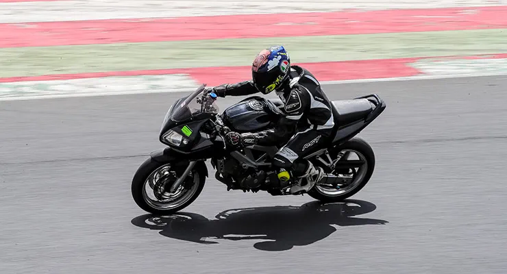
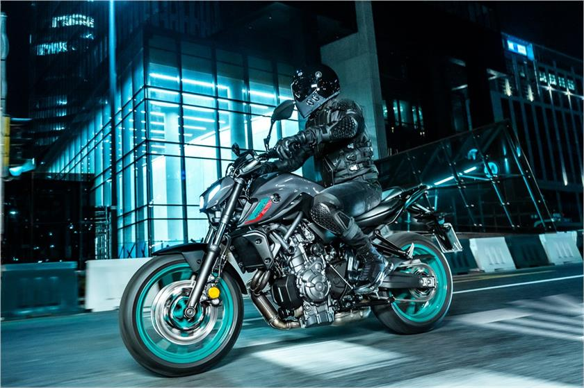
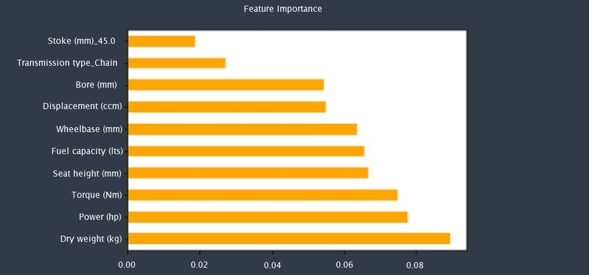
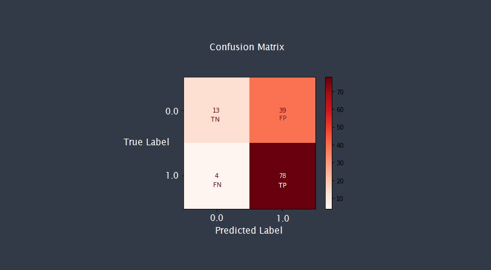
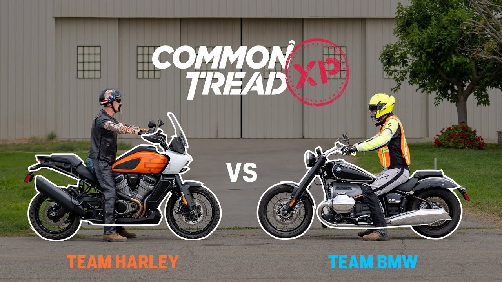

# Phase 3 Project
Student: Joshua Ruggles  
Instructor: Joe Comeaux/Morgan Jones  
Data Science Flex  
Accompanying blog post: https://joshua-ruggles.blogspot.com/2023/01/phase-3-project-walkthrough-and.html 
Link to data: ['all_bikez_curated.csv'](https://www.kaggle.com/datasets/emmanuelfwerr/motorcycle-technical-specifications-19702022)
# Project Overview
For this project we will look at feature importance in the rating of a proposed new motorcycle. Specifically we will be using classification tools from sklearn. We will be utilizing the "all_bikez_curated.csv" file from Kaggle, curated by Emmanuel F. Werr 

## Business Problem 
Our data science team has been contracted by a fairly new up and coming motorcycle manufacturer, Fi Motors who is struggling to find their new formula for a 'fan favorite' motorcycle.  

Being a company of motorcycle riders, they have tasked our team to come up with a plan to replicate the successes of platforms like the Yamaha MT-07 and the Suzuki SV650. Fi Motor's ultimate desire, figure out what makes a motorcycle that people want to ride.
 

Tarmac to track: The SV650 affordably does it all 
Suzuki SV650 on track, courtesy of Bennetts Insurance

 
Further reading: 
 
Yamaha MT-07: 
https://www.motorcyclenews.com/bike-reviews/yamaha/mt-07/2021/

https://www.motorcyclenews.com/bike-reviews/yamaha/mt-07/2014/

https://www.youtube.com/watch?v=RUp2_7RhZEo

Suzuki SV650: 
https://www.44teeth.com/suzuki-sv650-best-bike-ever/

https://timeless2wheels.com/604079/suzuki-sv650/

### Yamaha MT-07 & Suzuki SV650

If like me, you are an avid motorcycle rider, you know, have known, or are someone on one of these bikes. 

 

MT-07, courtesy of Yamaha Powersports
 

### Binary values for 'Rating'
Now that we have an average score for 'Rating', let's make a new column that will give us binary results, 1 being a rating above 3.4, 0 being a rating below.  

## Preprocessing : Expert opinion
While there is still a lot of data (and we anticipate MANY dummied columns if we keep all of these selections), let's consider what things our manufacturer, Fi Motors does NOT care about when making a bike.   
____________________________________________________________________________________________________
 
After careful consideration from the team, it was decided that the following categories aren't incredibly important to Fi Motors as a manufacturer:   

- Category:   
There are several different types of vehicles in our data set, let's make sure that we aren't looking at anything that isn't a motorcycle.
  
- Fuel system:   
Most new bikes now are fuel injected (fuel *infected* if you're an old person) and do not rely on a carburettor. Since most current motorcycle riders would find trouble using a carburettor (save for museum pieces like The Yamaha TW200, Honda XR650L or Suzuki DRZ400), we intend on making a modern motorcycle with modern features. Fuel injection, it is. 
   
- Gearbox:   
The only modern gearboxes are automatic (cvt transmissions like in the Honda Africa Twin or Rebel 1100), 5-speed (like on a Harley-Davidson) or 6-speed/6-speed with reverse (almost all modern sportbikes use 6-speed transmissions, reverse, again specifically for Honda, more specifically for the Goldwing). 6-speed transmissions are on both the Yamaha MT-07 and the SV650. 
  
- Fuel control:   
Fuel control most often comes down to SOHC (single overhead cam) or DOHC (dual overhead cam). Though there are differences, like Ducati's Desmodromic valve control system, most of the time the difference is writ elsewhere (like in horsepower and torque numbers). Ultimately this is a consideration in purchasing a bike (DOHC are often credited with producing more power out of the same displacement engine that a SOHC would) but not a huge consideration outside of racing. Even still, Fi is interested in seeing how fuel control might affect ratings. For the purposes of this model let's keep SOHC, DOHC, OHV, and the Desmodromic valve control system (because Ducati knows how to make a fun bike).     

- Front brakes:   
Stopping and the ability to stop quickly is incredibly important for riders that find themselves on the track but likely the bike Fi intends on proposing will either have single or dual disc brakes; 7,451 of the bikes in our database utilize either single or dual disc brakes. Let's stick with these two selections.
  

- Rear brakes:   
The rear brakes are often seen as an afterthought for entry level bikes. The bike needs to be able to stop but it is incredibly unlikely that we will need to know how the premium parts rank versus a bike that has a stock braking set up for the rear wheel. Likely the rear brake will mirror the setting of the front brake. 
  

- Front tire:   
The height of the front tire is often a consideration with adventure motorcycles and dirt bikes because a taller tire can traverse larger obstacles. This is a sub-genre of motorcycle riding and will likely not have a huge impact on the enjoyability of a motorcycle. 
  
- Rear tire:   
Unlike the front tire, the rear tire is usually judged on its width; the wider the tire, usually the wider the tire the better traction the rear wheel will be able to put power down to the ground. Sportbikes usually have a wider contact patch on the sides of the tire, where drag bikes will sometimes even run a car tire. Ultimately the rear tire is a consideration to make when changing out rubber, but not necessarily something that will make or break your ride. 
  

- Front suspension:   
Suspension is incredibly important when it comes to a motorcycle and certainly having a branded suspension set up is an attractive selling point (think WP or Ohlins for example). However, there are too many variables for suspension set ups in our data to make heads or tails of if a bike with upgraded suspension will rank higher than a bike that does not. Furthermore, these are entry-level motorcycles we are looking to potentially manufacture. In order to keep costs down, usually the brake system and suspension systems are unbranded generic parts bought at bulk discount. 
  

- Rear suspension:   
For the same reasons given on front suspension, we will remove rear suspension from our data for now. 
  

- Color options:   
The paint job on a bike is usually a subjective metric and throughout different model years, the big three Japanese manufacturers will put out different color options (most launch models are available in two due to cost saving measures).  

## Feature Importance: RandomSearchCV 3.0

RandomSearchCV 3.0 was our best performant model:   

Training : 0.839 
Test: 0.679 

 

 
RandomizedSearchCV 3.0 Confusion Matrix
 

## Accuracy : 0.679
What is the accuracy of our model? Ultimately, motorcycles are a pretty subjective thing. Even looking at the cult classic bikes that we picked there are certainly opinions that aren't necessarily positive on these bikes. That said, accuracy can be calculated in this way:   

Accuracy = # of true (positive and negative) outcomes / total # of observations
 

## Conclusion

Based on the predictive model we created, Fi Motors should consider making a bike with the following characteristics:  
  
- Dry weight of 188.89 kg  
- ~70 horsepower 
- ~75 Nm torque 
- Seat height around 790 mm 
- Fuel capacity of 16.86 liters (more obviously if you are considering a touring machine) 
- Wheelbase of 1483.67 mm  
- Displacement of 848 ccm  
- Bore of 81.37 mm   
- Final drive: Chain  
- Engine stroke: 45 mm  

# RandomizedSearchCV 3.0

In regards to performance, I believe that a 67.9% accuracy score is acceptable; motorcycles are incredibly subjective things and thus shines a spotlight on the prevalence and existence of different subsets of motorcycle culture, different riding styles, and well, the differences between different people. Were this a dataset on heart disease, diabetes, or healthcare I believe that no, an accuracy score of 67.9% is absolutely not an acceptable accuracy score. 
  

 

That said, I believe that the model very much is useful; for our purposes we are looking to identify _features_, and the way that we got the data for these features was specifically through _averages_ of the data. The value of this model is specifically tied to the business problem: we have identified features and feature outputs that should be magnified in the data and are technically the most important to a new manufacturer. We strove to create a predictive model that answers a fairly specific question: _what makes a motorcycle, fun?_ 
